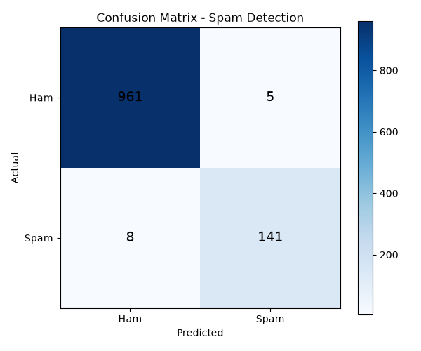

# spam-email-classifier
# Spam Email Classifier

A machine learning project that classifies SMS/email messages as spam or ham (not spam) using Naive Bayes text classification.

## Overview
This project uses the SMS Spam Collection dataset to build a text classification model. It covers the full NLP/ML workflow: text vectorization, model training, evaluation, and visualization with a confusion matrix.

## Tech Stack
- Python
- pandas, numpy
- scikit-learn (CountVectorizer, Multinomial Naive Bayes)
- matplotlib (visualization)

## Results
- **Accuracy:** 98.83%
- **Spam Precision:** 0.97
- **Spam Recall:** 0.95
- **F1-Score (Spam):** 0.96

The model correctly identifies the vast majority of spam messages while keeping false positives (legitimate messages flagged as spam) very low.

## Confusion Matrix

Out of 1,115 test messages, the model misclassified only 13 messages total (5 false positives, 8 false negatives).

## How to Run
pip install pandas numpy matplotlib scikit-learn
python spam_classifier.py
